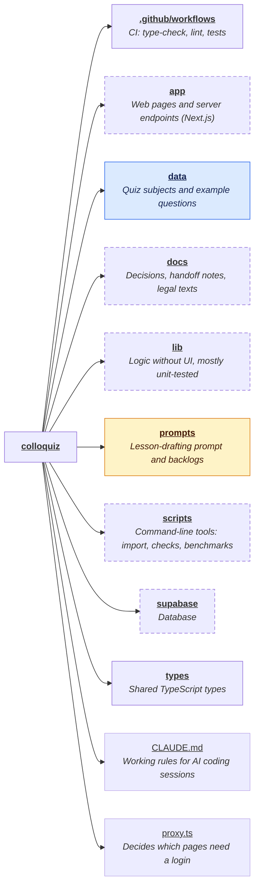
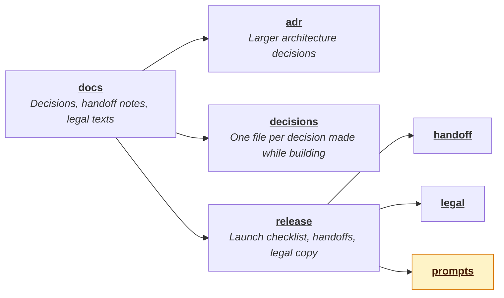
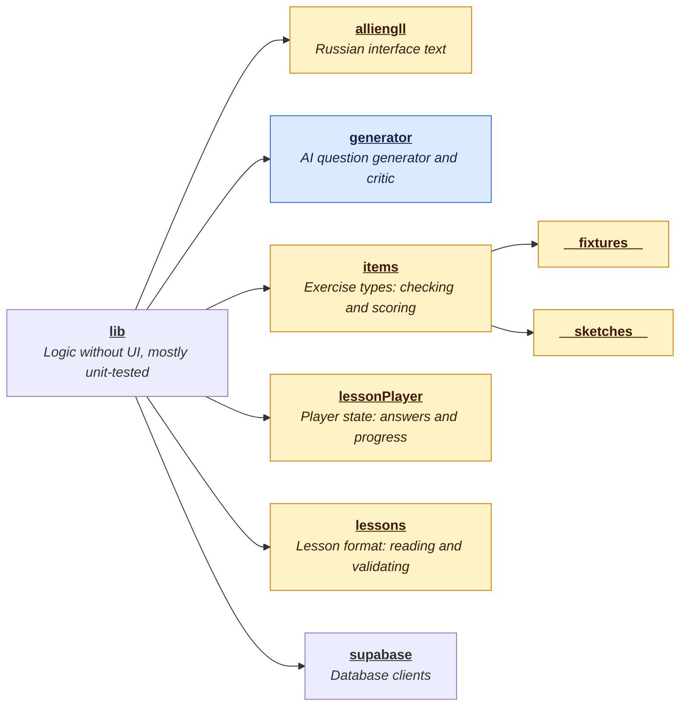
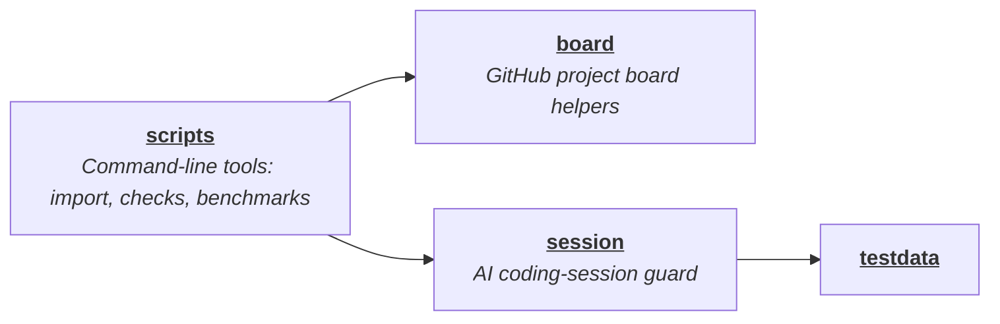
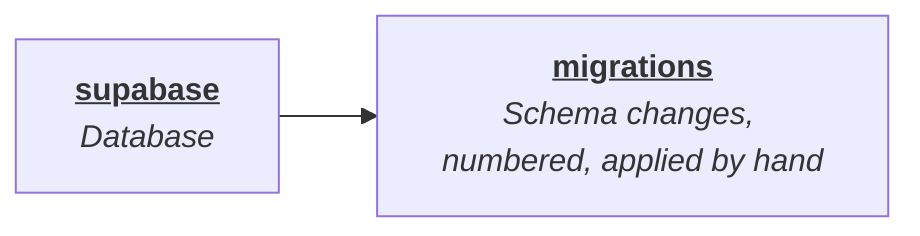

```mermaid
flowchart LR
  n0["<b><a href='https://github.com/JumpLikeFLEA/colloquiz/tree/main/app' style='color:inherit'>app</a></b><br/><i>Web pages and server endpoints (Next.js)</i>"]
  n1["<b><a href='https://github.com/JumpLikeFLEA/colloquiz/tree/main/app/(colloquiz)' style='color:inherit'>(colloquiz)</a></b><br/><i>Quiz platform, served under /app</i>"]
  n2["<b><a href='https://github.com/JumpLikeFLEA/colloquiz/tree/main/app/(colloquiz)/(auth)' style='color:inherit'>(auth)</a></b><br/><i>Log in, sign up, reset password</i>"]
  n3["<b><a href='https://github.com/JumpLikeFLEA/colloquiz/tree/main/app/(colloquiz)/(legal)' style='color:inherit'>(legal)</a></b><br/><i>Terms, privacy, subprocessors</i>"]
  n4["<b><a href='https://github.com/JumpLikeFLEA/colloquiz/tree/main/app/(colloquiz)/(main)' style='color:inherit'>(main)</a></b><br/><i>Signed-in pages, incl. admin and course editor</i>"]
  n5["<b><a href='https://github.com/JumpLikeFLEA/colloquiz/tree/main/app/(english)' style='color:inherit'>(english)</a></b><br/><i>English course pages, open to everyone</i>"]
  n6["<b><a href='https://github.com/JumpLikeFLEA/colloquiz/tree/main/app/(english)/courses/%5BcourseSlug%5D' style='color:inherit'>courses/[courseSlug]</a></b>"]
  n7["<b><a href='https://github.com/JumpLikeFLEA/colloquiz/tree/main/app/api' style='color:inherit'>api</a></b><br/><i>Server endpoints the pages call</i>"]
  n8["<b><a href='https://github.com/JumpLikeFLEA/colloquiz/tree/main/app/api/account' style='color:inherit'>account</a></b>"]
  n9["<b><a href='https://github.com/JumpLikeFLEA/colloquiz/tree/main/app/api/admin' style='color:inherit'>admin</a></b>"]
  n10["<b><a href='https://github.com/JumpLikeFLEA/colloquiz/tree/main/app/api/assignments' style='color:inherit'>assignments</a></b>"]
  n11["<b><a href='https://github.com/JumpLikeFLEA/colloquiz/tree/main/app/api/author' style='color:inherit'>author</a></b>"]
  n12["<b><a href='https://github.com/JumpLikeFLEA/colloquiz/tree/main/app/api/duels' style='color:inherit'>duels</a></b>"]
  n13["<b><a href='https://github.com/JumpLikeFLEA/colloquiz/tree/main/app/api/feedback' style='color:inherit'>feedback</a></b>"]
  n14["<b><a href='https://github.com/JumpLikeFLEA/colloquiz/tree/main/app/api/groups' style='color:inherit'>groups</a></b>"]
  n15["<b><a href='https://github.com/JumpLikeFLEA/colloquiz/tree/main/app/api/invites' style='color:inherit'>invites</a></b>"]
  n16["<b><a href='https://github.com/JumpLikeFLEA/colloquiz/tree/main/app/api/notifications' style='color:inherit'>notifications</a></b>"]
  n17["<b><a href='https://github.com/JumpLikeFLEA/colloquiz/tree/main/app/api/quiz' style='color:inherit'>quiz</a></b>"]
  n18["<b><a href='https://github.com/JumpLikeFLEA/colloquiz/tree/main/app/api/quiz-shares' style='color:inherit'>quiz-shares</a></b>"]
  n19["<b><a href='https://github.com/JumpLikeFLEA/colloquiz/tree/main/app/api/reports' style='color:inherit'>reports</a></b>"]
  n20["<b><a href='https://github.com/JumpLikeFLEA/colloquiz/tree/main/app/api/results' style='color:inherit'>results</a></b>"]
  n21["<b><a href='https://github.com/JumpLikeFLEA/colloquiz/tree/main/app/api/students/%5BstudentId%5D' style='color:inherit'>students/[studentId]</a></b>"]
  n22["<b><a href='https://github.com/JumpLikeFLEA/colloquiz/tree/main/app/auth' style='color:inherit'>auth</a></b><br/><i>Email confirmation, social-login return</i>"]
  n23["<b><a href='https://github.com/JumpLikeFLEA/colloquiz/tree/main/app/auth/callback' style='color:inherit'>callback</a></b>"]
  n24["<b><a href='https://github.com/JumpLikeFLEA/colloquiz/tree/main/app/auth/confirm' style='color:inherit'>confirm</a></b>"]
  n25["<b><a href='https://github.com/JumpLikeFLEA/colloquiz/tree/main/app/components' style='color:inherit'>components</a></b><br/><i>Shared UI pieces</i>"]
  n26["<b><a href='https://github.com/JumpLikeFLEA/colloquiz/tree/main/app/components/figma' style='color:inherit'>figma</a></b><br/><i>Image helper (vendored, still in use)</i>"]
  n27["<b><a href='https://github.com/JumpLikeFLEA/colloquiz/tree/main/app/components/lesson-player' style='color:inherit'>lesson-player</a></b><br/><i>The lesson player learners see</i>"]
  n28["<b><a href='https://github.com/JumpLikeFLEA/colloquiz/tree/main/app/components/ui' style='color:inherit'>ui</a></b><br/><i>Basic building blocks (vendored)</i>"]
  n0 --> n1
  n1 --> n2
  n1 --> n3
  n1 --> n4
  n0 --> n5
  n5 --> n6
  n0 --> n7
  n7 --> n8
  n7 --> n9
  n7 --> n10
  n7 --> n11
  n7 --> n12
  n7 --> n13
  n7 --> n14
  n7 --> n15
  n7 --> n16
  n7 --> n17
  n7 --> n18
  n7 --> n19
  n7 --> n20
  n7 --> n21
  n0 --> n22
  n22 --> n23
  n22 --> n24
  n0 --> n25
  n25 --> n26
  n25 --> n27
  n25 --> n28
  classDef g1 fill:#dbeafe,stroke:#2563eb,color:#172554
  class n1,n2,n3,n4 g1
  classDef collapsed stroke-dasharray:6 4
  class n2,n3,n4,n6,n8,n9,n10,n11,n12,n14,n15,n17,n18,n27 collapsed
  classDef g0 fill:#fef3c7,stroke:#d97706,color:#451a03
  class n5,n6,n27 g0
```

# Colloquiz

One web app at [colloquiz.app](https://colloquiz.app) with two products on the
same code, the same database and the same user accounts.

**Alliengll: English mini-courses** (the main focus now). Short English
courses for Russian speakers at levels A2 to B2. A course is 3 to 8 lessons of
10 to 15 minutes each: a little theory, then a few exercises, repeated. The
content is written by a partner, who promotes it on social media. The site
opens on these courses. The first courses are free; later ones will be sold
per course, each with a few free lessons as a sample.

**Colloquiz: the quiz platform** (where the project started). Quizzes on
general subjects, with progress, streaks, achievements, groups, duels and a
leaderboard. Tutors can invite students and assign quizzes. An AI generator
writes new questions, and an admin reviews them before anyone sees them. It
now lives under `/app`.

## Where things stand

- **Quiz platform:** live.
- **English courses:** the exercise engine, the lesson player and the course
  editor (with preview) are built. Next: the public landing page, the course
  catalogue and playing without an account. Payments come after that.

## Built with

Next.js 16 and React 19 (TypeScript), Tailwind CSS, Supabase (Postgres with
row-level security and auth), hosted on Vercel. The Anthropic API powers the
question generator.

## Map of the code

Each box shows how many files and lines a folder holds; click a name to open
it on GitHub. Open a section below the overview to see inside a folder.

<!-- codemap:start -->
<!-- Generated by codemap. Edit codemap.config.json and re-run; changes here are overwritten. -->



<sub>🟨 Alliengll (English courses) · 🟦 Colloquiz (quiz platform) · dashed border = has more subfolders than shown · open the sections below for detail</sub>

<details>
<summary><b>app/</b> — Web pages and server endpoints (Next.js)</summary>



</details>

<details>
<summary><b>docs/</b> — Decisions, handoff notes, legal texts</summary>



</details>

<details>
<summary><b>lib/</b> — Logic without UI, mostly unit-tested</summary>



</details>

<details>
<summary><b>scripts/</b> — Command-line tools: import, checks, benchmarks</summary>



</details>

<details>
<summary><b>supabase/</b> — Database</summary>



</details>
<!-- codemap:end -->

To refresh the map after moving folders around, edit `codemap.config.json`
if needed and run:

```sh
npx github:JumpLikeFLEA/codemap --write README.md
```

## More documentation

- [`docs/setup.md`](docs/setup.md): running it locally, environment
  variables, scripts, benchmarking.
- [`docs/handoff.md`](docs/handoff.md): why both products exist, who they
  are for, and the rules that follow from that. Read this first.
- [`docs/architecture.md`](docs/architecture.md): how the quiz platform works
  (partly out of date, see its note).
- [`docs/decisions/`](docs/decisions): every decision made while building.
- [`CLAUDE.md`](CLAUDE.md): working rules for AI coding sessions.
